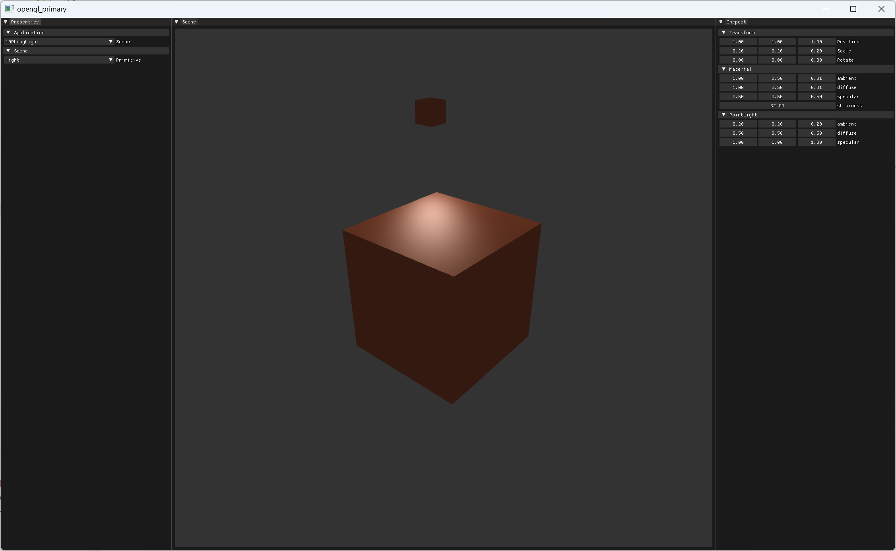
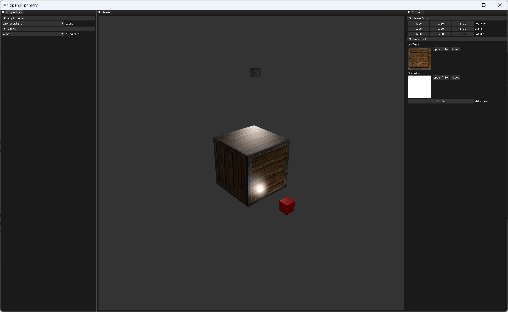
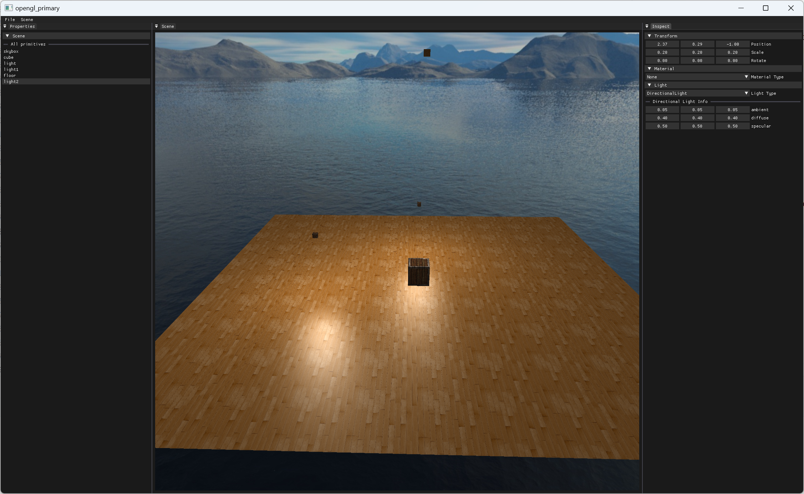
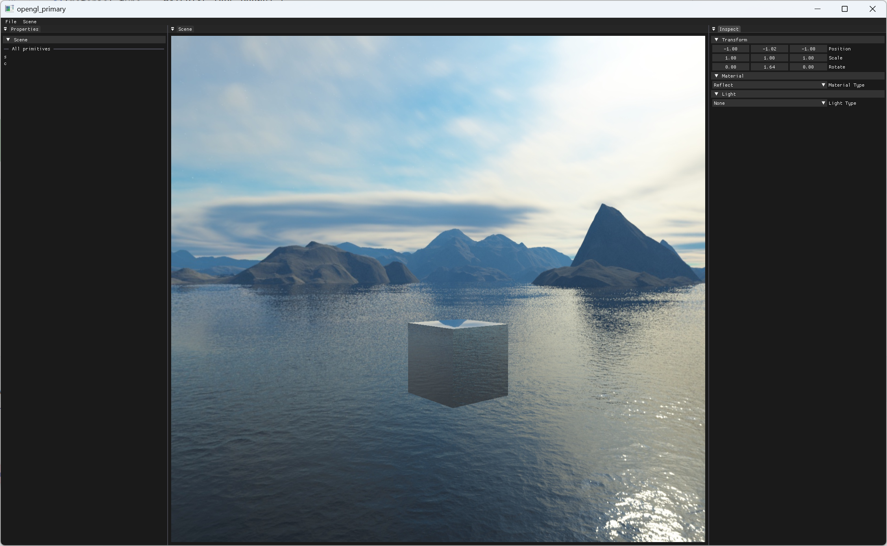
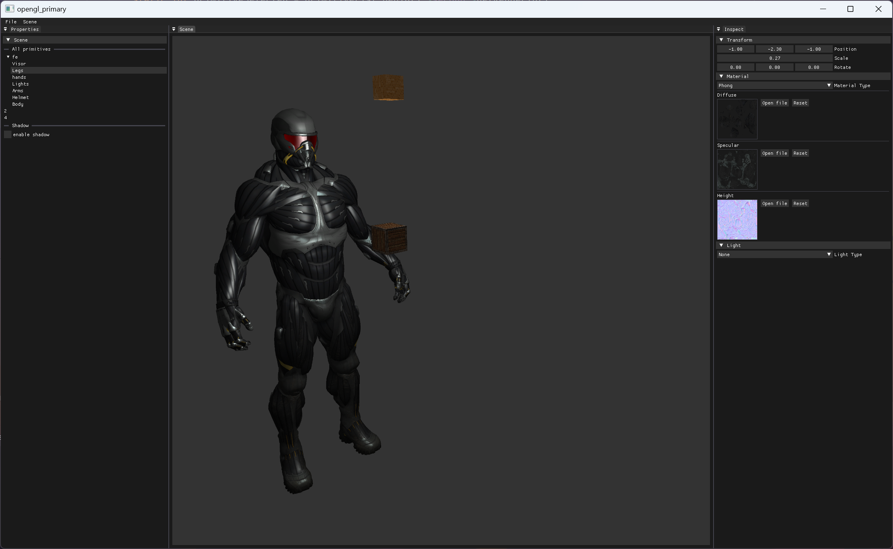
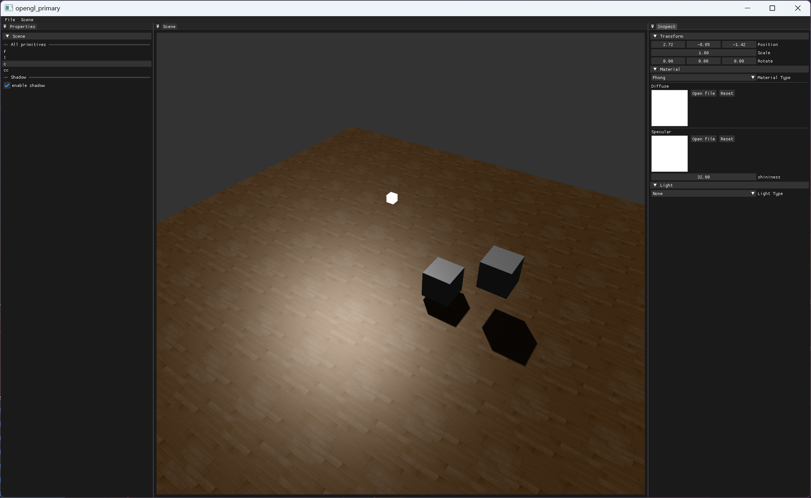

# opengl-primary
使用`C++`、`OpenGL`封装的场景编辑器

**TODO:**

- [x] ~~替换场景硬编码、可自由创建图元~~、并保存场景各类信息到文件中
- [ ] 接入`imguizmo`，实现图元拾取，控制图元移动及选择

**日程：**

|      日期      |                           完成情况                           |
| :------------: | :----------------------------------------------------------: |
|  `2024.2.24`   |       1. 接入日志库 2.封装基本功能模块类 3. 完成正方体       |
|  `2024.2.25`   | 1. 完成模型加载 2. 改进`VertexArray::setAttribute()`，使其自动计算`glVertexAttribPointer`所需要的参数 |
|   `2024.3.3`   |                  完成模板测试、混合、面剔除                  |
|  `2024.3.11`   |                          完成帧缓冲                          |
|  `2024.3.17`   | 1. 重写项目架构，并加入事件分发机制  2. 实现基于四元数的环绕相机，替换掉之前的FPS相机  3. 接入`ImGui`，通过帧缓冲直接渲染在`ImGui`窗口内 |
|  `2024.3.27`   | 新增`uniform buffer`并将`View`、 `Projection`矩阵使用`ubo`的方式传递至着色器 |
|  `2024.3.28`   |                       1. 新增冯氏光照                        |
|  `2024.3.29`   | 1. 新增光照贴图、点光源  2. 实现图元可通过ImGui动态切换纹理图片  3. 实现可自由添加多个点光源 |
|  `2024.3.30`   | 1. 实现在ImGui窗口内自由创建图元  2. 实现动态的创建、删除场景 |
|  `2024.3.31`   |  1. 实现平行光   2. 实现天空盒  3. 重构材质类，新增多种材质  |
|   `2024.4.2`   |                           实现反射                           |
| `2024.4.5\6\7` | 1. 解决了由于帧缓冲生成纹理格式为GL_RGBA导致模型效果异常的Bug  2. 将模型融入编辑器中，实现动态替换模型中某部分的纹理图 |
|  `2024.4.11`   |        实现平行光下的阴影（目前只实现单光源下的阴影）        |

**待修复Bug：**

- [x] ~~刚打开程序时，若切换的场景为默认场景，导致崩溃~~（重构成场景自由创建，Bug不存在了）
- [ ] 打开程序默认不会选中图元
- [ ] 事件分发与渲染过程的互相调用，导致不断递归

**演示：**

冯氏光照

自由创建多个点光源

点光源、平行光、天空盒

反射

多光源下的模型

平行光下的阴影效果

